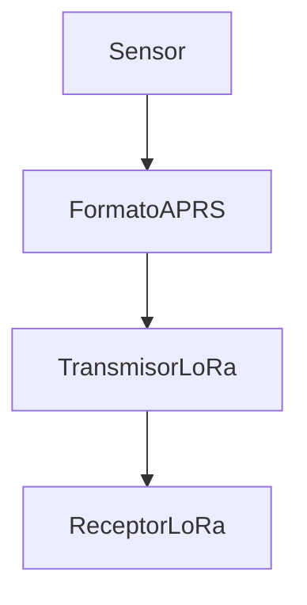
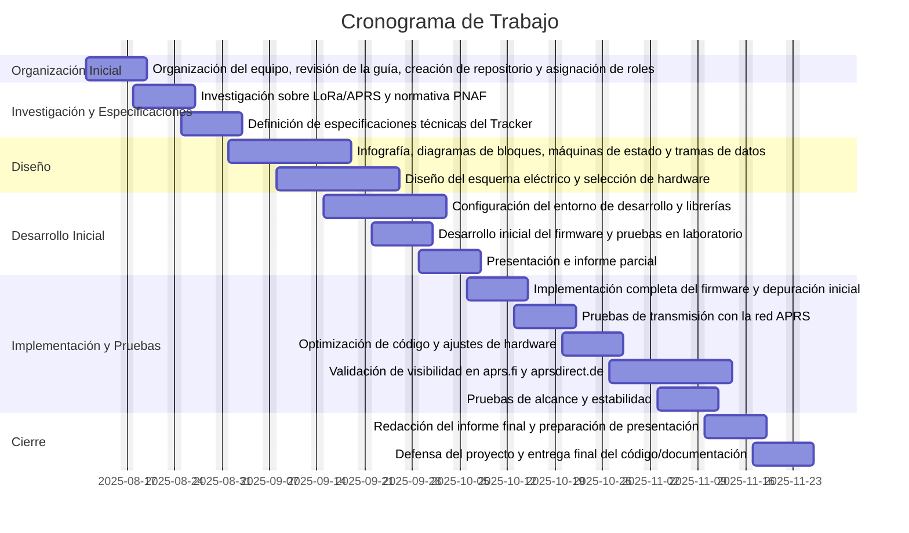

# Proyecto — Taller Integrador — EL5610

Este repositorio contiene el desarrollo de **firmware** para un módulo *tracker* basado en la placa **LilyGO T‑Beam ESP32 LoRa (433 MHz, SX1276)**. El objetivo es instrumentar un localizador de largo alcance y bajo consumo para escenarios rurales. El trabajo es realizado por:
- Nagel Mejía Segura  
- Óscar González Cambronero  
- Wilberth Gutiérrez Montero  

---

## Tabla de Contenidos
1. [Conceptos Teóricos](#conceptos-teóricos)
   - [APRS](#aprs)
   - [LoRa](#lora)
   - [Legislación en Costa Rica](#legislación-en-costa-rica)
2. [Contexto y Alcance](#contexto-y-alcance)
3. [Arquitectura del Sistema](#arquitectura-del-sistema)
4. [Estructura de Directorios](#estructura-de-directorios)
5. [Diagramas de Flujo](#diagramas-de-flujo)
6. [Construcción y Uso](#construcción-y-uso)
   - [Ejemplos LilyGO](#ejemplos-lilygo)
7. [Cronograma](#cronograma)
8. [Agradecimientos](#agradecimientos)
9. [Fuentes de Información](#fuentes-de-información)

---

## Conceptos Teóricos

### APRS
El **Automatic Packet Reporting System (APRS)** es un sistema de intercambio de datos en tiempo real ampliamente usado por radioaficionados. Permite reportar **posiciones GPS**, **telemetría**, **mensajes cortos** y **alertas**, utilizando radio paquete y protocolos digitales. Históricamente evolucionó para facilitar el seguimiento de móviles y la coordinación en emergencias, y hoy convive con **APRS‑IS**, una infraestructura en Internet que recolecta los reportes recibidos por estaciones *iGate*.

#### Detalles técnicos relevantes
- **Función principal:** estandariza el **formato** de la información (posición, estado, mensajes) que será transportada por el enlace de radio o por Internet.
- **Capa de enlace:** se apoya en **AX.25**.
- **Modulación habitual:** **AFSK Bell 202** a **1200 baudios** sobre FM; existen variantes a **9600 baudios** (G3RUH/FSK) según banda/entorno.
- **Bandas:** típicamente **VHF** alrededor de **144 MHz**. La distribución exacta depende de cada región.
- **Backbone en Internet:** mediante **APRS‑IS**, los paquetes recibidos por *iGates* se publican en servidores y visores (mapas en línea).

---

### LoRa
**LoRa** es una técnica de modulación de espectro ensanchado (**CSS, *Chirp Spread Spectrum***), diseñada por Semtech, que permite enlaces **de largo alcance** con **bajo consumo**. Sobre esta capa física se construye **LoRaWAN**, una red de área amplia para IoT. En este proyecto, LoRa se utiliza como **portadora de los paquetes APRS**, de forma que los reportes puedan cubrir grandes distancias con energía limitada.

#### Detalles técnicos relevantes
- **Rol en el sistema:** transportar por radio los paquetes estructurados (p. ej., APRS) con **robustez** frente a atenuación e interferencia.
- **Bandas ISM:** 433 MHz, 868 MHz y 915 MHz (según normativa local).
- **Ancho de banda:** 125 kHz, 250 kHz y 500 kHz (impacta tasa de datos, sensibilidad y alcance).
- **Parámetros clave:** *spreading factor* (SF), *bandwidth* (BW) y *coding rate* (CR) equilibran alcance, tiempo en aire y consumo.

---

### Legislación en Costa Rica
| Tipo        | APRS                                   | LoRa                                |
|-------------|----------------------------------------|-------------------------------------|
| Permisos    | Requiere licencia de radioaficionado   | Uso libre en bandas ISM             |
| Frecuencias | 144.390 MHz (referencia regional)      | 433.05–434.79 MHz, 920.5–928 MHz    |
| Potencia    | Según clase de licencia (p. ej., 200 W novicio) | Límite de **PIRE** típico: **30 dBm** |

> **Nota:** Deben respetarse los límites del **PNAF** y condiciones de **PIRE**. Por ejemplo, con potencia de salida de 24 dBm y ganancia de antena adecuada, la PIRE puede alcanzar valores superiores siempre que la normativa lo permita.

---

## Contexto y Alcance
El repositorio documenta la **viabilidad**, **arquitectura** y **aplicación práctica** de APRS sobre enlaces LoRa. Se cubren aspectos de capa física, parámetros de radio, organización del *payload* y consideraciones de operación en entornos rurales, donde el largo alcance y la autonomía energética son prioritarios.

## Arquitectura del Sistema
A alto nivel, el **sensor/MCU** genera un **paquete APRS**, el **transmisor LoRa** lo envía por el aire y un **receptor/gateway** lo captura para su posterior visualización o inyección en **APRS‑IS**. El uso de LoRa habilita cobertura extendida con bajo consumo, manteniendo la estructura de datos de APRS.

---

## Estructura de Directorios

```
Estructura
├── documentacion/               Reportes, avances y bitácoras
├── extra/                       Ejemplos adicionales para ESP32
│   ├── lib                      Librerías de LilyGO (externas)
│   └── ejemplos_lily            Código de ejemplo de LilyGO (externo)
├── firmware/                    Firmware del sistema
└── README.md
```

---

## Diagramas de Flujo



---

## Construcción y Uso

1. Instalar el entorno de desarrollo con **PlatformIO**.
2. Seleccionar el ejemplo apropiado en `platformio.ini` (descomentar la entrada correspondiente).
3. Compilar y programar la **LilyGO T‑Beam ESP32**.
4. Verificar en consola los mensajes de inicialización (GNSS, radio LoRa, parámetros de enlace).
5. Realizar una prueba de cobertura en campo y ajustar **SF/BW/CR** según el entorno.

### Ejemplos LilyGO

---

## Cronograma de Trabajo — Proyecto Tracker LoRa/APRS




## Agradecimientos
A Ricardo Guzmán (CA2RXU) por el repositorio de referencia que inspiró esta implementación y facilitó pruebas tempranas en campo.

**Repositorio base:** https://github.com/richonguzman/LoRa_APRS_Tracker

---

## Fuentes de Información
- Repositorio **LilyGO LoRa Series**: https://github.com/Xinyuan-LilyGO/LilyGo-LoRa-Series/tree/master  
- Documentación y bibliotecas incluidas en `extra/lib` y ejemplos en `extra/ejemplos_lily`  
- Recursos de APRS y APRS‑IS, así como documentación comunitaria sobre LoRa/LoRaWAN

> Para compilar y programar únicamente es necesario descomentar el ejemplo correspondiente en `platformio.ini`, construir con PlatformIO y cargar el binario a la T‑Beam.
